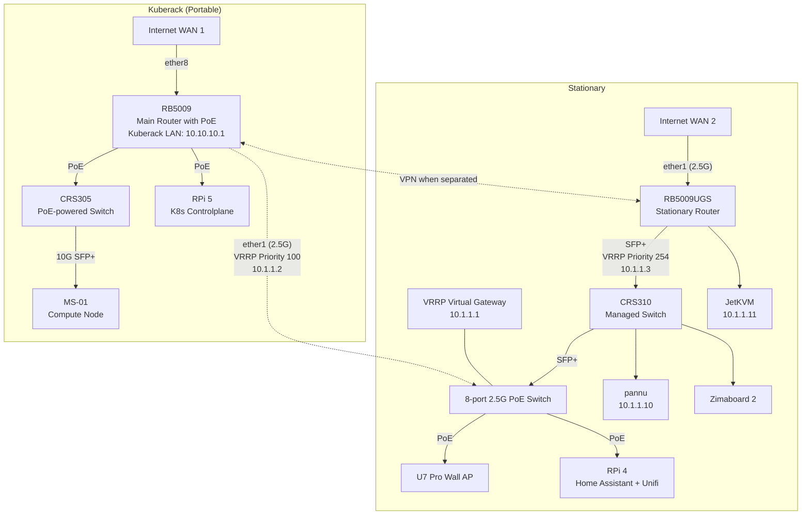

# Local Networking

This manages the MikroTik routers that provide redundant connectivity between the portable kuberack and stationary infrastructure.

## Network Setup

The network is composed of two main logical networks, connected by a shared high-availability backbone.

- **Kuberack LAN**: `10.10.10.0/24` (for devices connected only to the RB5009 and CRS305 switch)
- **Shared LAN (VRRP)**: `10.1.1.0/24` (a high-availability network for critical devices like `pannu` and the U7 Pro Wall AP)
- **VRRP Virtual Gateway**: `10.1.1.1`
- **WireGuard/ZeroTier VPN**: `10.255.255.0/24` (for site-to-site connectivity when separated)

### Network Diagram



## How It Works

_Note: The following describes the target architecture for the network. The implementation is ongoing and details are subject to change._

This network is designed for both high performance and automatic failover using a combination of a shared network segment, VRRP, and state-aware DHCP services.

### Connected Mode (Normal High-Performance Operation)

- **Unified Backbone**: The stationary network infrastructure creates a shared Layer 2 network (`10.1.1.0/24`). The RB5009 (via `ether1`) and the RB5009UGS (via a bridge of its LAN ports) connect to this network. Devices like `pannu` and the U7 Pro Wall AP connect here to get 2.5G connectivity with the Kuberack network.
- **Primary Router**: The RB5009UGS is the primary router (VRRP Master, priority 254) and handles all internet traffic for the shared network.
- **Central DHCP**: The RB5009UGS runs the primary DHCP server for the shared network. It provides leases to all devices, including static reservations for devices like `pannu`.
- **Backup Router (Standby)**: The RB5009 is in standby (VRRP Backup, priority 100). Its dedicated DHCP server for the shared network is **disabled** by a VRRP state-change script to prevent conflicts.

### Separated Mode (Failover Operation)

- **Failure Detection**: When the RB5009UGS loses power or fails, the RB5009 (if connected) detects the loss of VRRP heartbeats and automatically transitions to become the VRRP Master.
- **Failover DHCP Activation**: The moment the RB5009 becomes VRRP master, a VRRP `on-master` script instantly **enables** its DHCP server.
- **Resilient Connectivity**: This server provides **static DHCP leases** to critical devices (like `pannu` and `JetKVM`), ensuring they can get online or renew their leases even when the RB5009UGS is unavailable. The gateway remains `10.1.1.1`, which is now controlled by the RB5009.
- **Backup Path**: All traffic from the stationary network now flows through the RB5009 and out its own WAN connection.

## VRRP Setup

VRRP handles automatic failover between routers on the shared `10.1.1.0/24` network:

- **Virtual IP**: `10.1.1.1` (gateway for all devices on the shared network)
- **RB5009UGS**: Priority 254 (master when stationary setup is primary)
- **RB5009**: Priority 100 (backup, becomes master when RB5009UGS unavailable)

## VPN

When sites are separated, WireGuard/Zerotier (TBD) maintains connectivity between the `10.10.10.0/24` and `10.1.1.0/24` networks:

- **VPN Network**: `10.255.255.0/24`
- **RB5009 VPN IP**: `10.255.255.1`
- **RB5009UGS VPN IP**: `10.255.255.2`
- **Purpose**: Site-to-site connectivity, service access, management

## Implementation

The configuration is organized into two Terraform modules:

- **`module.stationary`**: RB5009UGS router and stationary infrastructure
- **`module.kuberack`**: RB5009 router and kuberack devices

### Usage

- **Normal operation**: `terraform apply`
- **Device specific apply**: `terraform apply -target=module.stationary`

### Bootstrap Scripts

Minimal RouterOS bootstrap scripts handle the initial setup required to prepare a device for Terraform management. The script files (`stationary_rb5009ugs.rsc` and `kuberack_rb5009.rsc`) are generated by Terraform from a single template (`bootstrap.tftpl.rsc`) and are checked into version control.

The final, complex configuration (like VRRP and high-performance routing) is managed by Terraform, which also uploads the latest version of the bootstrap script to the device on every `apply`.

If you modify the template or the configuration variables in `main.tf`, running `terraform apply` will automatically update the script files in `bootstrap/generated/`. You should then review these changes and commit them to version control.

## Bootstrap Process

To bootstrap a new MikroTik device or to update an existing one with the latest script, follow these steps:

1.  **Update Scripts (If Needed)**: If you have changed the bootstrap template or variables, run `terraform apply`. This will update the script files in `bootstrap/generated/`. Review the changes with `git diff` and commit them. For a first-time setup, the necessary scripts are already in the repository.

2.  **Upload Bootstrap Script**: Access the device's UI (WinBox or HTTP) and upload the device-specific bootstrap script (e.g., `stationary_rb5009ugs.rsc` for the RB5009UGS) from the `bootstrap/generated/` directory.

3.  **Reset Configuration**: Navigate to `System -> Reset Configuration` in the UI. Select `No Default Configuration` and choose the script uploaded in Step 2 from the `Run after Reset` option. Confirm and reset the device.

4.  **Initial Access & Configuration**: After the device reboots, it will be accessible by connecting your computer to any of the LAN ports. Your computer will receive an IP address via DHCP in the appropriate range. Access the router at its management IP (`10.1.1.3` for the RB5009UGS).

5.  **Set Admin Password**: Log in with the username `admin` and no password. Immediately set a strong password for the `admin` user. This password should match the credentials defined in your secrets (viewable via `just view`).

6.  **Terraform Management**: The device is now ready for Terraform. Run `terraform apply` again. Terraform will connect via the device's IP and apply the final configuration. It will also upload the latest version of the bootstrap script, so for future updates, you only need to re-run the reset step (Step 3).

## TODO

- [ ] Implement stationary module (RB5009UGS)
  - [x] Minimal bootstrap script
  - [x] Basic network configuration (IP addressing, DHCP)
  - [x] Configure failover DHCP server with static leases (pannu, JetKVM)
  - [x] VRRP setup for failover
  - [ ] Firewall rules
- [ ] Implement kuberack module (RB5009 + CRS305)
  - [x] RB5009 minimal bootstrap script
  - [x] RB5009 basic network configuration
  - [x] RB5009 VRRP setup (backup role)
  - [ ] CRS305 minimal bootstrap script (basic Layer 2 switch)
  - [ ] RB5009 firewall rules
  - [ ] CRS305 basic switch configuration
- [x] DNS and Peer Configuration
  - [x] Set system identity for each router
  - [x] Add authoritative DNS records for all devices (pannu, JetKVM)
- [x] VPN configuration
  - [x] ZeroTier site-to-site tunnel configuration
  - [x] Routing between sites when separated (fallback routes with proper metrics)
  - [x] Management access via ZeroTier tunnel
- [x] Testing and validation
  - [x] Test failover scenarios (~16-17 second convergence time)
  - [x] Performance testing (~50Mbps through ZeroTier tunnel)
- [ ] Refactoring
  - [ ] move DHCP servers to terraform, with initial config being done with static IP configuration

## Important Notes

### Device Mode Restrictions

Some MikroTik devices have device-mode security features that may block certain packages like ZeroTier by default. If ZeroTier fails to start, you may need to:

1. **Check if ZeroTier is enabled**:

   ```
   /system device-mode print
   ```

2. **Enable ZeroTier in device mode** (if not already enabled):

   ```
   /system device-mode update zerotier=yes
   ```

3. **Physically press the MODE button** on the device to confirm the change (if applicable)

4. **Reboot the device** for the change to take effect

Without this step, ZeroTier instances may fail to start with device-mode related errors.
