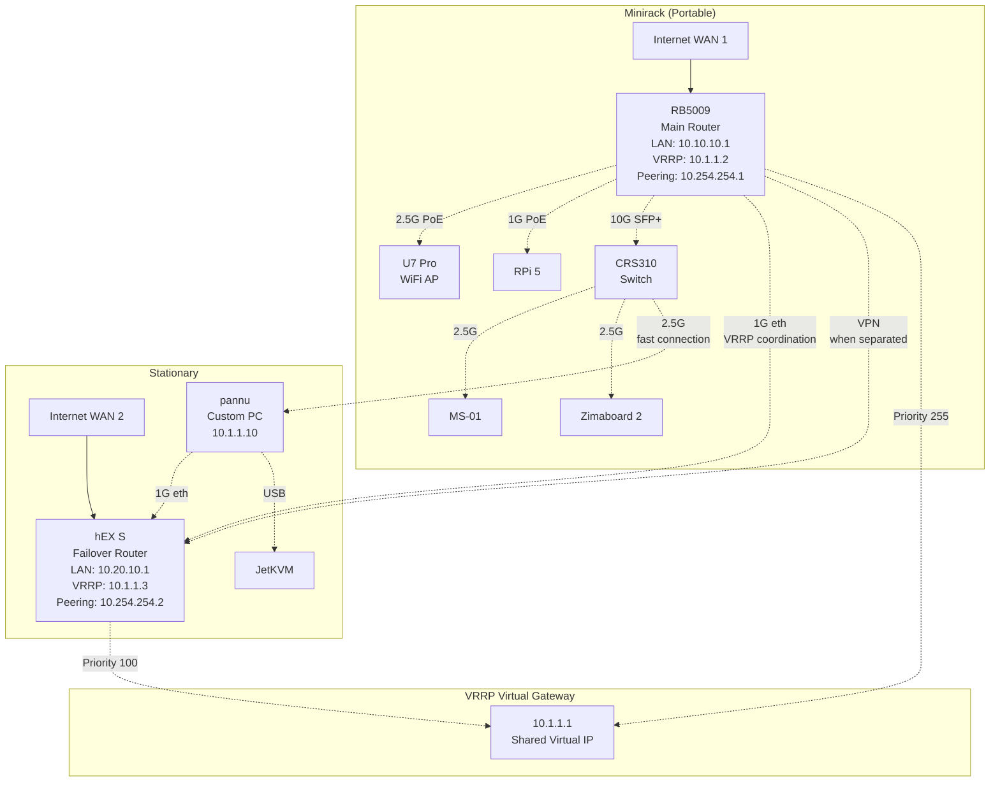

# Local Networking

This manages the MikroTik routers that provide redundant connectivity between the portable minirack and stationary infrastructure.

## Network Setup

Two logical sites that can work independently or together:

- **Minirack**: Portable stuff with main router and switch
- **Stationary**: Fixed infrastructure with failover router and main server

### IP Ranges

- **Minirack LAN**: `10.10.10.0/24` (for devices connected only to the RB5009)
- **Stationary LAN**: `10.20.10.0/24` (for devices connected only to the hEX S)
- **VRRP Network**: `10.1.1.0/24` (a virtual network for high-availability services like `pannu`)
- **VRRP Virtual Gateway**: `10.1.1.1`
- **Peering Network**: `10.254.254.0/30` (a private link between the routers)
- **WireGuard/ZeroTier VPN**: `10.255.255.0/24` (for site-to-site when separated)

### Network Diagram

## How It Works

_Note: The following describes the target architecture for the network. The implementation is ongoing and details are subject to change._

This network is designed for both high performance and automatic failover using a combination of fast switching, VRRP, and state-aware DHCP services.

### Connected Mode (Normal High-Performance Operation)

- **Unified Network**: In the final configuration (managed by Terraform), the RB5009 treats the minirack and stationary networks as a single, unified Layer 2 domain. This allows devices to communicate directly over the fastest possible path.
- **Primary Router**: The RB5009 is the primary router (VRRP Master, priority 255) and handles all internet traffic.
- **High-Speed Data Path**: `pannu` connects via its 2.5G port to the CRS310 switch, which is connected to the RB5009's 10G port. All of `pannu`'s traffic flows symmetrically over this high-speed path.
- **Central DHCP**: The RB5009 runs the primary DHCP server for the entire network. It provides leases to all devices, including `pannu`.
- **Backup Router (Standby)**: The hEX S is in standby (VRRP Backup, priority 100). Its dedicated DHCP server for `pannu` is **disabled** by a VRRP state-change script to prevent conflicts.

### Separated Mode (Failover Operation)

- **Failure Detection**: When the minirack is disconnected or the RB5009 fails, the hEX S detects the loss of VRRP heartbeats and automatically transitions to become the VRRP Master.
- **Failover DHCP Activation**: The moment the hEX S becomes master, a VRRP `on-master` script instantly **enables** a small, dedicated DHCP server on the hEX S.
- **Resilient Connectivity for `pannu`**: This server provides a **static DHCP lease** to `pannu`, ensuring it can get online or renew its lease even when the main router is unavailable. `pannu`'s gateway remains `10.1.1.1`, which is now controlled by the hEX S.
- **Backup Path**: All traffic from the stationary network now flows through `pannu`'s 1G link to the hEX S and out its own WAN connection.

## VRRP Setup

VRRP handles automatic failover between routers:

- **Virtual IP**: `10.1.1.1` (gateway for devices on the VRRP network)
- **RB5009**: Priority 255 (master when connected)
- **hEX S**: Priority 100 (backup, becomes master when RB5009 unavailable)

## VPN

When sites are separated, WireGuard/Zerotier (TBD) maintains connectivity:

- **VPN Network**: `10.255.255.0/24`
- **RB5009 VPN IP**: `10.255.255.1`
- **hEX S VPN IP**: `10.255.255.2`
- **Purpose**: Site-to-site connectivity, service access, management

## Implementation

The configuration is organized into two Terraform modules:

- **`module.stationary`**: hEX S router and stationary infrastructure
- **`module.minirack`**: RB5009 router and portable minirack devices

### Usage

- **Normal operation**: `terraform apply`
- **Stationary only**: `terraform apply -target=module.stationary`
- **Minirack only**: `terraform apply -target=module.minirack`

### Bootstrap Scripts

Minimal RouterOS bootstrap scripts handle the initial setup required to prepare a device for Terraform management. They configure just enough for the device to be accessible and secure. For now, this includes a basic firewall configuration, which may be fully migrated to Terraform in the future. The final, complex configuration (like VRRP and high-performance routing) is managed by Terraform.

## Bootstrap Process

To bootstrap a new MikroTik device and integrate it into the Terraform-managed network, follow these steps:

1.  **Upload Bootstrap Script**: Access the device's UI (WinBox or HTTP) and upload the device-specific bootstrap script (e.g., `hexS.rsc` for the hEX S) from the `bootstrap/` directory.
2.  **Reset Configuration**: Navigate to `System -> Reset Configuration` in the UI. Select `No Default Configuration` and choose the script uploaded in Step 1 from the `Run after Reset` option. Confirm and reset the device.
3.  **Initial Access & Configuration**: After the device reboots, it will be accessible in two ways:
    *   **Via Management LAN**: Connect your computer to **ether4** or **ether5**. Your computer will receive an IP address via DHCP in the `10.20.10.0/24` range. Access the router at `http://10.20.10.1`.
    *   **Via Peering Link**: If connected to the main router, it is accessible at its peering IP (`10.254.254.2`). This is the primary path for Terraform management.
4.  **Set Admin Password**: Log in with the username `admin` and no password. Immediately set a strong password for the `admin` user. This password should match the credentials defined in your secrets (viewable via `just view`).
5.  **Terraform Management**: The device is now ready for Terraform. Terraform will connect via the peering IP and apply the final configuration, including VRRP, failover DHCP, and DNS records.

## TODO

- [ ] Implement stationary module (hEX S)
  - [x] Minimal bootstrap script
  - [ ] Basic network configuration (IP addressing, DHCP)
  - [ ] Configure failover DHCP server with static leases (pannu, JetKVM)
  - [ ] VRRP setup for failover
  - [ ] Firewall rules
- [ ] Implement minirack module (RB5009 + CRS310)
  - [ ] RB5009 minimal bootstrap script
  - [ ] CRS310 minimal bootstrap script (basic Layer 2 switch)
  - [ ] RB5009 basic network configuration
  - [ ] RB5009 VRRP setup (master role)
  - [ ] RB5009 firewall rules
  - [ ] CRS310 basic switch configuration
  - [ ] CRS310 VLAN setup (if needed)
- [ ] DNS and Peer Configuration
  - [ ] Set system identity for each router
  - [ ] Configure peer DNS resolution between routers
  - [ ] Add authoritative DNS records for all devices (routers, pannu, JetKVM)
- [ ] VPN configuration
  - [ ] Choose between WireGuard and ZeroTier
  - [ ] Site-to-site tunnel configuration
  - [ ] Routing between sites when separated
- [ ] Testing and validation
  - [ ] Test failover scenarios
  - [ ] Test lift and shift functionality
  - [ ] Performance testing
